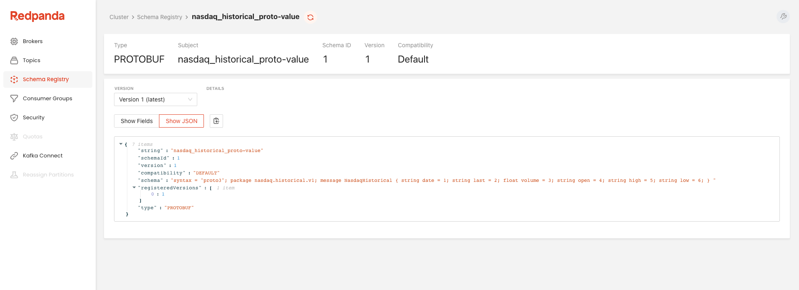

# Redpanda Console Demo

https://docs.redpanda.com/docs/console/

## Setup environment

Start a local Redpanda cluster and Redpanda Console using the provided Docker Compose file:

```shell
docker-compose up -d
[+] Running 7/7
 ⠿ Network redpanda-console_default      Created
 ⠿ Container redpanda1                   Started
 ⠿ Container redpanda2                   Started
 ⠿ Container redpanda3                   Started
 ⠿ Container connect                     Started
 ⠿ Container debezium-mysql              Started
 ⠿ Container redpanda-console            Started
```

Once the containers have started, Redpanda Console will be available at http://localhost:8080.

## Produce JSON data (Go)

The [data](./data/) folder contains historical stock data for four symbols. The data can be downloaded from the [Nasdaq](https://www.nasdaq.com/market-activity/stocks/coke/historical) website in CSV format.

Run the [Go](./go/main.go) application to read the data files in parallel, transform each line from CSV to JSON, and send the messages to a Redpanda topic named `nasdaq_historical`. The application intentionally slows the stream down by adding a small delay after producing each message, and another delay before committing offsets on the consumer side to simulate lag. This example does not use the Schema Registry.

```shell
cd go
go run main.go -brokers localhost:19092,localhost:29092,localhost:39092
```


## Produce Protobuf data (Java)

The [Protobuf](https://developers.google.com/protocol-buffers/) example uses the same historical stock data as above, but uses [Confluent's Protobuf Schema Serializer and Deserializer](https://docs.confluent.io/platform/current/schema-registry/serdes-develop/serdes-protobuf.html) to send Protobuf messages to a Redpanda topic named `nasdaq_historical_proto`. The Java-based library registers the Protobuf schema in the Schema Registry, which is subsequently used by Redpanda Console to [deserialize messages](https://docs.redpanda.com/docs/console/features/record-deserialization/) into JSON for [filtering](https://docs.redpanda.com/docs/console/features/programmable-push-filters/).

```shell
cd java
mvn clean compile assembly:single
java -jar target/protobuf-example-1.0.0-jar-with-dependencies.jar
```



## Push Filters for Nasdaq data

Use Redpanda Console's [push filters](https://docs.redpanda.com/docs/console/features/programmable-push-filters/) to search for specific messages in the `nasdaq_historical` or `nasdaq_historical_proto` topics.

**Note** that you might have to provide a custom offset to see the results (e.g. start offset: `0`, max results: `50`)

1. Filter the topic by the key `NVDA`:

```javascript
return (key == "NVDA");
```

2. Include only the records that have had a 10% increase in value:

```javascript
var open = parseFloat(value.Open.slice(1));
var close = parseFloat(value.Last.slice(1));
return 100/open*close > 110
```


## Debezium + MySQL

Demonstrate a change data capture (CDC) worflow with [Kafka Connect](https://kafka.apache.org/documentation/#connect), [Debezium](https://debezium.io/), and [MySQL](https://www.mysql.com/).

### Check out the example MySQL schema

```shell
docker exec -it debezium-mysql /bin/bash

mysql -u mysqluser -pmysqlpw

USE inventory;
SHOW TABLES;
SELECT * FROM customers;
```

### Configure the Debezium connector

```shell
curl \
  --request POST \
  --url http://localhost:8083/connectors \
 	--header 'Content-Type: application/json' \
 	--data '{
  	"name": "inventory-connector",
   	"config": {
    	"connector.class": "io.debezium.connector.mysql.MySqlConnector",
     	"tasks.max": "1",
     	"database.hostname": "mysql",
     	"database.port": "3306",
     	"database.user": "debezium",
     	"database.password": "dbz",
     	"database.server.id": "184054",
     	"database.server.name": "dbserver1",
     	"database.include.list": "inventory",
     	"database.history.kafka.bootstrap.servers": "redpanda1:9092,redpanda2:9092,redpanda3:9092",
     	"database.history.kafka.topic": "schema-changes.inventory"
 		}
	}' | jq '.'

curl --request GET \
     --url http://localhost:8083/connectors/inventory-connector/status | jq '.'
```

### Consume the customers topic

```shell
export REDPANDA_BROKERS=localhost:19092,localhost:29092,localhost:39092

rpk topic list
NAME                                  PARTITIONS  REPLICAS
dbserver1                             1           1
dbserver1.inventory.addresses         1           1
dbserver1.inventory.customers         1           1
dbserver1.inventory.geom              1           1
dbserver1.inventory.orders            1           1
dbserver1.inventory.products          1           1
dbserver1.inventory.products_on_hand  1           1
inventory.configs                     1           1
inventory.offset                      25          1
inventory.status                      5           1
schema-changes.inventory              1           1

rpk topic consume dbserver1.inventory.customers --offset start
```

5. Update the customers table in MySQL

```sql
INSERT INTO customers VALUES (1005, "Jared", "Hall", "jared@redpanda.com");
INSERT INTO customers VALUES (1006, "Kevin", "Marowatsanga", "kevin@vectorized.com");
UPDATE customers SET email="kevin@redpanda.com" WHERE id=1006;
```

The changes will appear in the `dbserver1.inventory.customers` topic in Redpanda.